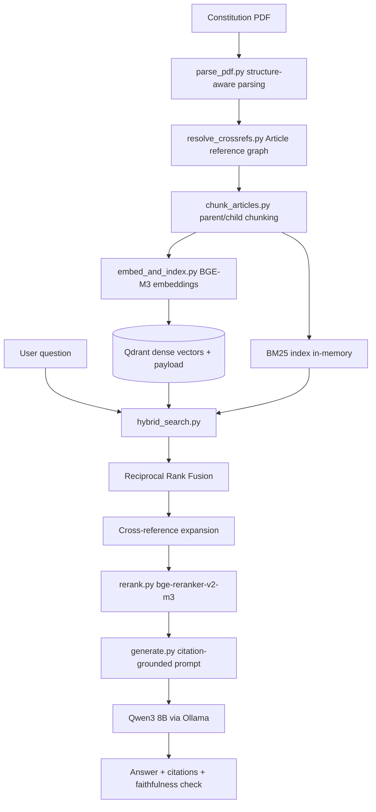

# RAG System: Constitution of Pakistan

A production-oriented Retrieval-Augmented Generation system for querying the Constitution of the Islamic Republic of Pakistan — fully open-source, citation-grounded, and built to say "I don't know" rather than guess on a legal document where a confident wrong answer is worse than no answer.

## Why this isn't just "chat with a PDF"

Single-document RAG demos are common and usually shallow. This one leans into what actually makes a constitution hard to retrieve and answer correctly from:

- **Cross-references everywhere** — Articles constantly point at each other ("subject to Article 8," "notwithstanding Article 199"). Naive chunking destroys these relationships; this system resolves them into an explicit reference graph at ingestion time.
- **Amendments** — the source document annotates amended/inserted text with footnote markers tied to specific amendment Acts (e.g. Article 9A, the right to a clean environment, was inserted by the 26th Amendment in 2024). This system extracts that provenance as structured data, not just prose.
- **High-stakes accuracy** — a wrong answer about a fundamental right isn't a shrug. Every generated claim is required to cite a specific Article, and the system is instructed — and evaluated — on whether it actually refuses to answer when the retrieved context doesn't cover the question, rather than filling the gap from the model's general knowledge.

## Architecture



Served behind a FastAPI layer (`src/api/main.py`) with models loaded once at startup, not per-request.

## Fully open-source stack

| Component | Choice | Why |
|---|---|---|
| Embeddings | BAAI/bge-m3 | Apache 2.0, strong multilingual retrieval quality |
| Vector store | Qdrant | Self-hosted, native hybrid (dense + sparse) support |
| Keyword search | Hand-rolled BM25Okapi | No `rank_bm25` dependency — demonstrates the algorithm, not just a library call |
| Reranker | BAAI/bge-reranker-v2-m3 | Open-weight cross-encoder, meaningful precision gain over vector-only |
| LLM | Qwen3 8B via Ollama | Fully local generation, no API keys |
| Eval | RAGAS + a dependency-free tier-1 check | Standard metrics when available, always-on fallback when not |

No proprietary APIs anywhere in the pipeline.

## Key design decisions

- **Parent-child retrieval**: small clause-level chunks are what's embedded and searched (precision), but the LLM always receives the full parent Article (complete legal context) — never a lone fragment.
- **Contextual chunking**: every embedded chunk is prefixed with its Article/Part/Chapter heading before embedding. A bare clause like *"(2) The State shall not make any law which takes away..."* is close to meaningless in isolation; the prefix is what makes it findable.
- **Sequential-number clause splitting**: `(2)` is only treated as a real clause boundary if it's the Article's actual second clause — this avoids false splits on in-text citations like "under clause (2) of Article 8."
- **Hybrid retrieval + RRF fusion**: BM25 catches exact-term/Article-number queries that don't need to be *semantically* similar; dense search catches paraphrased questions. Reciprocal Rank Fusion combines both rankings without having to pick one.
- **Cross-reference expansion**: retrieval doesn't just return top-scoring chunks — it also pulls in Articles the top results explicitly reference, from the graph built in Section 2. Guaranteed complete legal context instead of hoping the embedding model surfaces it too.
- **Citation grounding + refuse-if-unsure**: enforced in the system prompt and checked automatically (both a cheap regex-based check and, when available, RAGAS's faithfulness metric) — not just asserted.

## Quickstart

```bash
# 1. Ingest (run once, or whenever the source PDF changes)
python3 src/ingestion/parse_pdf.py --input data/raw/constitution.pdf --output data/processed/articles.json
python3 src/ingestion/resolve_crossrefs.py --input data/processed/articles.json --output data/processed/articles_with_refs.json
python3 src/ingestion/chunk_articles.py --input data/processed/articles_with_refs.json --child-output data/processed/child_chunks.json --parent-output data/processed/parent_chunks.json

# 2. Bring up infra + pull the model
docker compose up -d qdrant ollama ollama-pull

# 3. Embed and index (on-demand, not part of default `up`)
docker compose --profile ingest run --rm ingest

# 4. Serve
docker compose up -d api
curl http://localhost:8000/health

# 5. Query
curl -X POST http://localhost:8000/query -H "Content-Type: application/json" \
    -d '{"question": "What does Article 9A say, and when was it added?"}'
```

## Evaluation results

*Fill this in from `eval/results/*.json` after running each configuration — this before/after comparison is the single most convincing piece of evidence in this repo, more than any individual component.*

```bash
python3 eval/run_eval.py --golden eval/golden_dataset.json --run-name bm25_only --bm25-only
python3 eval/run_eval.py --golden eval/golden_dataset.json --run-name hybrid
python3 eval/run_eval.py --golden eval/golden_dataset.json --run-name hybrid_reranked
```

| Run | Retrieval hit rate | Correct refusal rate | Citation faithfulness (basic) | RAGAS faithfulness | RAGAS answer relevancy |
|---|---|---|---|---|---|
| BM25-only | TODO | TODO | TODO | TODO | TODO |
| Hybrid (BM25 + dense) | TODO | TODO | TODO | TODO | TODO |
| Hybrid + reranking | TODO | TODO | TODO | TODO | TODO |

## Repository structure

```
rag-pakistan-constitution/
├── README.md
├── docker-compose.yml
├── Dockerfile
├── requirements.txt
├── src/
│   ├── ingestion/
│   │   ├── parse_pdf.py          # PDF -> structured Articles (Part/Chapter/amendment history)
│   │   ├── resolve_crossrefs.py  # Article reference graph
│   │   ├── chunk_articles.py     # parent/child chunking
│   │   └── embed_and_index.py    # BGE-M3 embeddings -> Qdrant
│   ├── retrieval/
│   │   ├── hybrid_search.py      # BM25 + dense + RRF + cross-ref expansion
│   │   └── rerank.py             # cross-encoder reranking
│   ├── generation/
│   │   └── generate.py           # citation-grounded prompt + Ollama client + faithfulness check
│   └── api/
│       └── main.py               # FastAPI serving layer
├── eval/
│   ├── golden_dataset.json
│   ├── run_eval.py
│   └── results/                  # versioned eval runs, one file per configuration
└── data/
    ├── raw/                      # source PDF
    └── processed/                # articles.json, chunks, etc. (generated, not committed)
```

## Cost and staleness

- **No per-query API cost** — everything runs locally. The real cost is compute: embedding/reranking latency and whatever you pay to host Ollama + Qdrant if this were deployed rather than run locally.
- **Staleness**: this is a single, mostly-static legal document, but it isn't frozen — new amendments happen. The ingestion pipeline is fully idempotent (re-running `embed_and_index.py` upserts by stable chunk ID rather than duplicating), so refreshing the index after a new amendment Act is a matter of re-running the pipeline on an updated source PDF, not a special-cased migration.

## Known limitations

- The eval golden dataset currently has 8 question/answer pairs — a starter set covering each question category (direct lookup, negation/exception, numeric, amendment-aware, out-of-scope), not the 50-100 needed for statistically meaningful numbers. Expanding it is the highest-priority next step.
- Clause splitting handles top-level numbered clauses `(1)`, `(2)`, `(3)`; lettered sub-clauses `(a)`, `(b)` stay bundled within their parent clause rather than becoming separate chunks.
- Cross-reference resolution matches `Article N` mentions; it doesn't yet resolve references to Schedules, Parts, or bare "this Chapter" phrasing.
- Amendment-footnote parsing is calibrated against this specific PDF edition's formatting; a different source PDF would need the regex patterns in `parse_pdf.py` re-verified against its actual layout.
- No automated re-indexing trigger yet — refreshing after a real amendment is a manual pipeline re-run, not an automated watch/trigger.

## What I'd do with more time

- Expand the golden eval set to full coverage across all Articles, with CI running it on every change and failing the build if faithfulness or refusal-rate regresses
- Extend clause splitting to lettered sub-clauses for finer-grained retrieval on long, list-heavy Articles
- Extend cross-reference resolution to Schedules and Part-level references
- Add an automated re-indexing trigger keyed to source-document checksum changes
